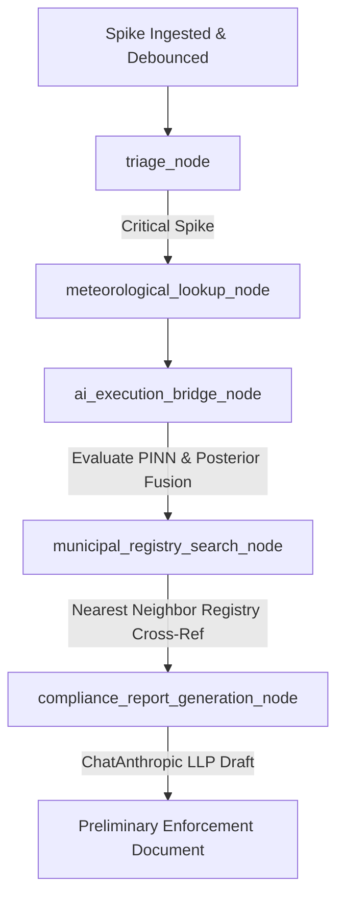

# PlumeTrace: Real-Time Inversion Modeling & Source Attribution for Urban Air Quality

PlumeTrace is a state-of-the-art physics-informed AI and agentic automation dashboard designed for the real-time detection, localization, and regulatory attribution of toxic industrial gas leaks in dense urban sectors. 

By marrying **Physics-Informed Neural Networks (PINN)**, real-time **IoT sensor streams**, and **Agentic Graph Orchestration (LangGraph)**, PlumeTrace automates the entire pipeline from emission spike detection to preliminary legal enforcement warnings.

---

## 1. Project Conceptual Overview & Philosophy

Urban air quality is typically monitored at discrete geographic locations. However, when an IoT sensor registers a hazardous concentration spike of a pollutant like $SO_2$ or $PM_{2.5}$, identifying *which* upstream industrial facility is responsible is a highly complex fluid dynamics inverse problem. 

Simple geometric back-tracing (e.g., straight-line upwind ray tracing) fails in complex urban terrains due to variable meteorological vectors, boundary-layer turbulence, and turbulent diffusion. Conversely, classical computational fluid dynamics (CFD) models are too computationally expensive to run in real time.

**PlumeTrace solves this challenge through a hybrid approach:**
1. **Surrogate ML Modeler:** A PyTorch Physics-Informed Neural Network (PINN) acts as a high-speed surrogate solver of the advection-diffusion fluid transport equation, evaluating raw concentration profiles across a city grid in milliseconds.
2. **Physics Likelihood Fusion:** The raw concentration maps are fused dynamically with a physical advection-diffusion plume likelihood model using live sensor readings to construct a sharp, high-confidence source probability distribution.
3. **Agentic Action & Registry Matching:** An autonomous LangGraph state machine consumes the fused spatial output, cross-references it with local municipal property registries, fetches real-time meteorological vectors, and drafts formatted enforcement warnings citing historical compliance records.

---

## 2. Model Architecture & Theoretical Physics

### The Advection-Diffusion Governing Equation
The physical dispersion of a gas plume in a 2D horizontal boundary layer is governed by the second-order partial differential equation (PDE) for advection-diffusion:

$$\frac{\partial C}{\partial t} + u \frac{\partial C}{\partial x} + v \frac{\partial C}{\partial y} - D \left(\frac{\partial^2 C}{\partial x^2} + \frac{\partial^2 C}{\partial y^2}\right) = 0$$

Where:
* $C(x, y, t)$ is the spatial-temporal gas concentration.
* $u, v$ are the localized wind velocity components (East-West and North-South, respectively).
* $D$ is the isotropic molecular and turbulent diffusion coefficient.

### The Physics-Informed Neural Network (PINN) surrogate (`pinn_engine.py`)
To approximate $C(x, y, t)$, the network is configured to minimize both data-fit error and violations of the governing PDE above:

```
                  ┌──────────────────────────────┐
                  │   Coordinates (x, y, t)      │
                  └──────────────┬───────────────┘
                                 ▼
                  ┌──────────────────────────────┐
                  │  Fourier Feature Projection  │  (Mitigates spectral bias)
                  └──────────────┬───────────────┘
                                 ▼
                  ┌──────────────────────────────┐
                  │ 8x ResNet Blocks (w=128)     │  (With LayerNorm & Adaptive Swish)
                  └──────────────┬───────────────┘
                                 ▼
                  ┌──────────────────────────────┐
                  │  Softplus Activation Output  │  (Enforces physical positivity C > 0)
                  └──────────────┬───────────────┘
                                 ▼
                         [Predicted C]
                                 │
         ┌───────────────────────┴───────────────────────┐
         ▼                                               ▼
┌──────────────────────────────┐                ┌──────────────────────────────┐
│       Data Loss (MSE)        │                │       PDE Residual Loss      │
│   (Model vs Observations)    │                │  (Physics Autograd Check)    │
└──────────────────────────────┘                └──────────────────────────────┘
```

* **Spectral Bias Mitigation:** Inputs $(x, y, t)$ undergo a random Fourier feature projection ($\sigma=4.0$, 16 dimensions) to allow the coordinate MLP to learn high-frequency spatial gradients.
* **Residual Connections:** 8 residual hidden blocks (128 units wide) prevent vanishing gradients during high-order backpropagation.
* **Differentiable Activations:** We employ **Adaptive Swish** (Swish with a learnable $\beta$ parameter) to guarantee continuous non-zero second-order derivatives, which are crucial for computing the Laplacian $\nabla^2 C$ during PyTorch autograd.
* **Physical Positivity:** A final Softplus activation ensures that the network cannot output non-physical negative concentrations ($C \ge 0$).

### PINN Training and Optimization Pipeline
* **Dynamic Loss Weighting (SoftAdapt):** The joint loss function balances data MSE, PDE residual violations, and boundary/initial condition errors. Weights are adjusted dynamically via the `SoftAdaptWeighter` to favor terms with high error slopes.
* **Residual-Based Adaptive Refinement (RAR):** Collocation points are initially sampled using a Sobol sequence. Every 100 epochs, the region is evaluated, and the network automatically oversamples coordinates exhibiting the highest PDE residuals, focusing training resources on the plume boundaries.

---

## 3. Hybrid Physics-Neural Posterior Fusion

The raw output of the PINN forward pass represents a broad concentration spread. To convert this into a sharp point-source probability distribution, PlumeTrace implements a Bayesian posterior fusion step:

$$\text{Posterior}(x_s, y_s) \propto \text{Neural Prior}(x_s, y_s)^{0.35} \times \exp\left(-\frac{\text{MSE}(\text{model vs observations})}{\sigma^2_{\text{temp}}}\right)$$

1. **Neural Prior:** The PINN-generated spatial concentration grid, normalized and smoothed.
2. **Likelihood Mask:** An analytical advection-diffusion plume model calculates expected sensor readings for every candidate source grid coordinate $(x_s, y_s)$. The Mean Squared Error (MSE) between expected and actual sensor observations determines the likelihood, scaled by temperature $\sigma^2_{\text{temp}}$.
3. **Wind-Field Snapping:** Because the mathematical source prediction is continuous and could fall on water bodies (e.g., the Hudson River), a spatial-meteorological snapping algorithm maps the prediction to the most likely registered industrial complex:
   * It calculates the physical distance from each registered facility to the sensor.
   * If a factory is directly adjacent to the sensor (<150m), it is immediately matched.
   * Otherwise, it scores facilities based on their upwind angular alignment (bearing must match the wind field) and proximity to the theoretical upwind trace, preventing unphysical snapping.

---

## 4. Agentic Graph Orchestration (`agent_orchestrator.py`)

When an IoT sensor crosses the hazard threshold, the **LangGraph Orchestrator** is triggered:



1. **Ingestion & Debounce:** Handled by [mqtt_handler.py](file:///c:/Users/sudu/Desktop/ieeehackton/backend/app/mqtt_handler.py). Spikes are filtered through a 15.0-second mutex lock to prevent concurrent redundant runs during a single emission event.
2. **Triage:** Evaluates the gas concentration level against local regulatory safety parameters.
3. **Meteorological Lookup:** Calls real-time local mesonet APIs to retrieve current wind speeds, direction bearings, and boundary-layer temperature.
4. **AI Inversion Bridge:** Invokes the PyTorch PINN checkpoint, applies the dynamic posterior fusion, and calculates the snapped source coordinate.
5. **Municipal Registry Search:** Queries the local database using coordinates to fetch the facility name, corporate parent, zoning permit, and compliance history.
6. **Report Generation:** Connects to Claude (`ChatAnthropic`) to draft a structured three-paragraph warning letter citing the exact meteorological vectors, source uncertainty bounds, and historical infractions, ordering the facility to preserve all log records.

---

## 5. Directory Structure Map

```text
PlumeTrace/
│
├── agent_orchestrator.py      # LangGraph state machine, tool definitions, LLM prompt templates
├── pinn_engine.py             # PyTorch Neural Net class, RAR sampler, SoftAdapt, and physics solvers
├── mock_sensors_8.py          # Synthetic IoT telemetry generator (8-station mesh)
├── README.md                  # Comprehensive project documentation
├── .gitignore                 # Excludes caches, build directories, and node modules
│
├── backend/                   # FastAPI Server, Database, and Broker Configuration
│   ├── amqtt.yaml             # MQTT broker configuration (ports, listeners, auth)
│   ├── passwords.txt          # Encrypted passwords/auth for broker connections
│   ├── app/
│   │   ├── main.py            # FastAPI main application endpoints, CORS, and auth
│   │   ├── database.py        # SQLAlchemy SQLite initialization and schema definitions
│   │   ├── mqtt_handler.py    # gmqtt background thread, spike detection, and graph trigger
│   │   └── sse_manager.py     # Asynchronous Server-Sent Events broker
│   └── .venv/                 # Python local virtual environment (ignored in git)
│
├── frontend/                  # Next.js 14 Web Application
│   ├── package.json           # PNPM workspace dependencies
│   ├── next.config.mjs        # Next.js build compilation config
│   ├── src/
│   │   ├── app/
│   │   │   ├── layout.tsx     # Root web layout & font loading
│   │   │   └── page.tsx       # SSE listener connection and dashboard state coordination
│   │   └── components/
│   │       ├── MapEngine.tsx  # MapLibre layout, dynamic flow indicators, snapping, and fly-to
│   │       ├── SidebarLogs.tsx# Telemetry packet list and human-in-the-loop audit log
│   │       └── HeaderStats.tsx# Link connection status, alert counts, and live gas values
│   └── .next/                 # Production optimized client builds (ignored in git)
│
└── model_artifacts/           # Trained PINN Weights & Execution Summaries
    ├── plumetrace_pinn_checkpoint.pt          # PyTorch serialized weights (8 residual blocks)
    └── plumetrace_pinn_metadata.json          # Loss history and model validation parameters
```

---

## 6. Services & Deployment Guide

### Prerequisites
* Python 3.10+
* Node.js 18+ (with `pnpm` package manager)

### Step 1: Start the MQTT Broker
Navigate to the backend directory and launch the `amqtt` broker using its password config:
```bash
cd backend
..\backend\.venv\Scripts\amqtt.exe -c amqtt.yaml
```

### Step 2: Launch the FastAPI Application
Open a new terminal, activate the virtual environment, and launch the ASGI server on port 8000:
```bash
cd backend
.venv\Scripts\python.exe -m uvicorn app.main:app --port 8000
```

### Step 3: Run the Web Dashboard
Navigate to the frontend folder, install dependencies, and start the Next.js client on port 3000:
```bash
cd frontend
pnpm install
pnpm run dev
```

### Step 4: Run the Telemetry Simulation
Start the 8-sensor IoT simulated telemetry script to publish regular updates and trigger periodic plume spikes:
```bash
.venv\Scripts\python.exe backend/mock_sensors_8.py
```

Open http://localhost:3000 in your browser to view the live dashboard. When a telemetry spike triggers, click **"Run Forensic Attribution Engine"** to see the PINN solver and agent graph pinpoint the source complex!
